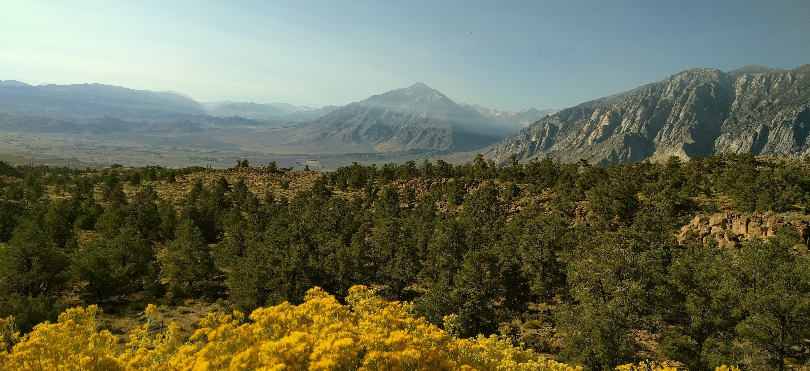

Hi. Thanks for visiting my website.

I am a PhD student in [Dr. Nathan Kraft](https://sites.lifesci.ucla.edu/eeb-kraft/)'s plant community ecology research group at the [University of California, Los Angeles](https://www.ucla.edu). I like to spend my time thinking about the origins, maintenance, structure, and consequences of diversity.

For my dissertation research, I work with the annual plant community in [Sedgwick Reserve](http://sedgwick.nrs.ucsb.edu/) to ask how plant functional traits -- traits that summarize plant ecological strategies -- help explain how species interact across environmental gradients. I am also keenly interested in learning about the role of dynamic feedbacks between plants and soil microbial communities in maintaining plant diversity, and am pursuing theoretical and experimental research on this question. For more information on my dissertation research and the side-projects that keep me occupied, please visit the [projects]() page and [email me](mailto::gaurav.kandlikar@gmail.com) with any questions.

During my time at UCLA, I am also trying to make an effort to build my sense of environmental and educational ethics. Through [workshops](https://www.edx.org/course/an-introduction-to-evidence-based-undergraduate-stem-teaching), talking to students, and reading [reports](https://successfulstemeducation.org/about/nrc-report), I have learned a great deal about the barriers that minority students face in science classrooms. I am committed to doing my part in helping minimize these barriers, but I don't claim to have any answers. I am always eager to have conversations about this topic, and would be happy to get any reading recommendations.